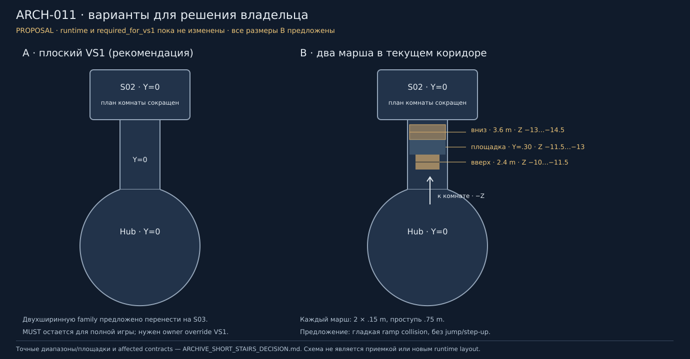

# ARCH-011: решение владельца — 2026-10-07

Статус: **PROPOSAL / OWNER DECISION PENDING**. Восстановлен remote
`1f38cb4806e5489dfb9af60bbf4fa2e83d297e0e`; production STABLE
`1419f35f110321fe64ade212ae7b6b2196f1770d`. Нового решения о лестницах
в этом HEAD нет. Канонические требования и runtime этим документом не изменены.

Схема в плане использует фактический коридор X=[−2,2], Z=[−15,−8]
и существующие плоские полы Y=0. Все цветные лестницы и размеры ниже —
**proposal**, а не утвержденный канон. Север на схеме соответствует −Z.

| Выбор | Точное предложение | Последствия и проверка |
| --- | --- | --- |
| **A — рекомендую** | Сохранить плоский VS1. Явно перенести обязательную двухширинную ARCH-011 family на S03 (канонический диапазон 1–9), после GATE-VS1, с отдельным будущим layout brief. Утвердить изменение `required_for_vs1` и зависимости GATE-VS1 только для этой строки. | Не требует смены accepted пола, движения, камер, маршрута, targets или spawn/save. ARCH-011 остается MISSING для полной игры. После одобрения — точечная правка VS1 dependency и counts, сохранение MUST/stages/variants, затем проверка gate ledger. S03 не начинается до закрытия остальных условий GATE-VS1. |
| **B — лестницы в VS1** | В существующем коридоре Wing I два последовательных марша: вверх шириной 2.4 m, затем вниз шириной 3.6 m; перепад 0.30 m. При движении к −Z: нижняя площадка Z=[−10,−9], первый марш Z=[−11.5,−10], верхняя площадка Z=[−13,−11.5], второй марш Z=[−14.5,−13], нижняя площадка Z=[−15,−14.5]. Все центрированы X=0. Верхняя площадка Y=0.30; Hub и комната остаются Y=0. Две ступени по 0.15 m, проступь 0.75 m на каждом марше. | Нужна новая согласованная corridor geometry/collision: замена части плиток и прежнего единого floor box, переход ширин на верхней площадке, боковая защита без precision walking, проверка стен/арок/потолка/LOS. Предлагается гладкая collision ramp под ступенями, уклон ≈11.31°; walk-only контроллер без jump/step-up. Реальная проходимость должна быть доказана физикой, не предполагается принятой. |

Рекомендация A: лестницы сейчас не обслуживают ни один принятый перепад высот,
а B добавляет пересмотр коридора ради asset row, увеличивает regression scope
и отдаляет визуальный тест. A требует **явного** owner override; без него
текущий `required_for_vs1=true`, MISSING и открытый GATE-VS1 сохраняются.
Рекомендация не является разрешением начать S03 или исключить другие условия.

## Что затронет B

| Контракт | Граница |
| --- | --- |
| Collision / пол | Коридорный box `(0,−.15,−11.5)` и tile floor в `archive_main.tscn`; две dedicated simple ramps, верхняя площадка и безопасные боковые границы. Не использовать detailed render mesh collision. |
| Player | Сохраняются capsule radius .35 / height 1.8, snap .15, walk 2.6, existing walk-only API. Проверить движение в обе стороны, по диагонали/краям, остановку/разворот и pause/focus на склоне. Любой необходимый step-up/jump — отдельное решение, не часть этой рекомендации. |
| Interaction / clues | Не перемещать Hub lens/socket/panel/lever, S02 rings/emitter/Star/focus/Hearth или gate. Проверить 2.5 m reach, ray LOS, channel/gate/navigation readability с новой высоты. |
| Spawn / save | Существующие Intro `(0,.004,4)`, Awakened `(0,.004,3)`, Star `(0,.004,−17)`, Hearth `(0,.004,−19)` лежат вне proposal. DTO/checkpoint schema прежние. Проверить quiet load всех checkpoints, падение/застревание и физический возврат через лестницы; не добавлять checkpoint без необходимости и решения. |
| Art / budget | Сначала отдельный bounded brief двух ширин, pivots, UV/material reuse, landings/rail/ceiling clearance; editable Blender + GLB/LFS upload/retrieval/reopen/use. Не переделывать accepted окружение сверх согласованного corridor delta. |
| Приемка | Native Low/Medium в обоих направлениях, physical traversal, S00 handoff/S01 awakening/S02 Star→Hearth/retry/save/load/Hub return. Hardware performance и художественное одобрение владельцем отдельно. |

Для выбора достаточно «A — перенос ARCH-011 на S03 и правка VS1 dependency»
или «B — утвердить предложенный коридорный layout и ramp collision».
При B последующий source/export brief фиксируется до производства.
До выбора приостановлен только ARCH-011; независимые обязательные VS1 scopes разрешены.

Sources: REQUIRED_ASSET_TABLE ARCH-011; ARCHIVE_SHORT_STAIRS_LAYOUT_AUDIT;
NARRATIVE_CANON S01/S02/S03; TECHNICAL_BASELINE input/player/accessibility;
S01_HUB_FLOOR_ACCEPTANCE; actual corridor/room floors, player scene and spawns.
