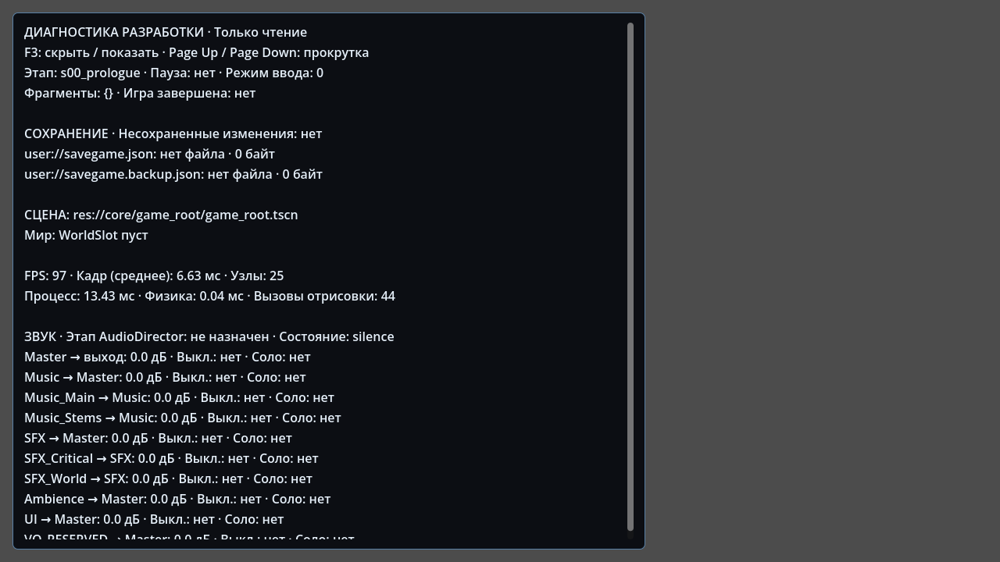

# Development inspection tools

Status: **PASS**, 2026-09-21.

Epic: `epic/00-foundation`.
Feature: `feature/00-foundation/debug-tools`.

Validated runtime/test revision: `bc72748de3b03e13418518c963aa40979afe7386`.
Validated `game/` tree: `b49af21753302adde4aa406635918d33e6b7a5ac`.
The publication check confirmed that the GitHub API commit contains the exact
locally tested tree. The original local commit and this mapping are recorded in
the [validation log](evidence/debug_tools_2026-09-21.log).

## Use

From the repository root, run the standard Godot 4.7.2 editor executable:

```sh
godot --path game -- --dev-tools
```

- **F3** hides/shows the inspector. Hidden tools stop collecting snapshots.
- **Page Up / Page Down** scroll long snapshots while the panel is visible.
- The panel does not take GUI focus or change mouse capture, pause, routing,
  gameplay state, audio settings or save data.
- No project InputMap actions were added or changed.

The inspector is opt-in. `GameRoot` dynamically loads it only when all three
conditions hold: `OS.is_debug_build()`, `App.BUILD_FLAVOR == "development"`, and
the `--dev-tools` user argument. The panel also checks the gate when instantiated.
There is no production preload, scene reference or script type dependency on
`core/debug/`. An actual release executable rejects the feature even when the
argument is supplied and `BUILD_FLAVOR` retains its scaffold value.

## Scope

`debug_snapshot.gd` collects detached read-only snapshots; `debug_overlay.gd`
handles presentation, refresh and development keys. The overlay is a GameRoot
child, not an autoload. The baseline remains exactly eight autoloads.

The Russian panel shows:

- current stage, collected fragment data and completion flag;
- SaveManager's current dirty flag, primary/backup file presence and byte size;
- bounded JSON previews, or missing/unreadable/malformed/oversize status;
- AudioDirector stage/state and all ten buses' routing, gain, mute and solo;
- current scene, WorldSlot children, pause and input mode;
- FPS, average processed-frame delta over the refresh interval, engine process
  and physics monitor times, node count and draw calls.

Visible snapshots refresh at most twice a second. Each save preview is limited
to 256 KiB of input and 220 displayed JSON characters; viewing never repairs,
loads, creates or deletes a save. JSON parsing here is inspection only, not
SaveGame schema validation. The SaveManager and AudioDirector remain their
previous scaffolds; full persistence and audio playback are later milestones.

The UI uses Godot's embedded default font. All Russian upper/lower-case letters,
including Ё/ё, were checked for glyph availability, followed by a real rendered
X11 screenshot and visual inspection. Scroll controls keep long content within
the default 1280×720 window without releasing the gameplay mouse.



## Validation actually performed

The final feature run used a fresh `git archive` of committed `game/` files,
without an inherited `.godot/` cache. Every process below exited with code 0;
the final Godot logs contained no script/resource errors or warnings.

| Check | Result |
| --- | --- |
| Godot 4.7.2 clean editor import | PASS |
| Normal startup with no development argument | PASS; inspector resource not loaded |
| Explicit development startup and App safe exit | PASS |
| Read-only state, file hashes and detached snapshot data | PASS |
| Live stage, save-dirty and audio-state refresh | PASS |
| Missing, valid, malformed and oversized save previews | PASS; source files unchanged |
| F3 press/release/echo, long-content scrolling, paused inspector | PASS |
| Held movement, E, shared Esc, mouse capture and GUI focus | PASS |
| Eight-autoload/GameRoot/WorldSlot startup regression | PASS |
| Existing InputMap event-dispatch regression | PASS |
| Existing real-mixer audio-bus routing/gain/mute regression | PASS |
| Normal project startup beyond its first frame | PASS |
| X11 Forward+ inspector, Cyrillic and viewport bounds | PASS |
| Actual release export with development resources and `--dev-tools` | PASS; `debug=false`, inspector not loaded |
| Actual release export after removing `core/debug/`, with `--dev-tools` | PASS; startup and App safe exit remain independent |

Runtime: `4.7.2.stable.official.ed1daf0bf`, standard GDScript build.
Graphical validation used Vulkan 1.4.318, Mesa 25.2.8 llvmpipe/LLVM 20.1.2 and
an authenticated local Xvfb display. The graphical audio driver was Dummy.

The official standard export-template archive was SHA-256 verified as
`f298490b8d44d934be425a5a65a51bf15f422428b229a06a6e11d9ffea248011` before
extracting and using `linux_release.x86_64` for both release fixtures.

## Reproduce

```sh
godot --headless --path game --editor --import
godot --headless --path game res://tests/debug_tools_smoke.tscn
godot --headless --path game res://tests/debug_tools_smoke.tscn -- --dev-tools --expect-overlay
godot --path game res://tests/debug_tools_smoke.tscn -- --dev-tools --expect-overlay
godot --headless --path game --script res://tests/engine_preflight.gd
godot --headless --path game --script res://tests/input_map_smoke.gd
godot --headless --path game --script res://tests/audio_bus_smoke.gd
godot --headless --path game --quit-after 120
```

An optional `--screenshot=/absolute/path.png` user argument on the graphical
test saves the actual rendered viewport. The test scene is never attached to
the production scene or autoload list. Its temporary save-preview files use
unique names and are removed; canonical save files are only hashed/read.

To repeat the release checks, use disposable copies of `game/`, omit `.godot/`,
and set only those copies' main scene to `res://tests/debug_tools_smoke.tscn`.
The harness instantiates the unchanged production GameRoot. Export with the
official standard 4.7.2 Linux release template, `all_resources`, and an unencrypted
script export. Run the resulting executable with `--headless -- --dev-tools`.
Require `debug=false`, `DEBUG_TOOLS PASS`, no inspector resource load and exit 0.
Repeat from a fresh disposable copy with `core/debug/` removed **before import
and export**. Production export settings/main scene are not modified by this
procedure.

## Limits and integration

These monitor readings are diagnostics, not a target-hardware profiling pass.
GTX 1060 performance, Windows export/execution and physical audio output were
not measured. Blender and LFS binaries are not involved in this feature.
The forward-only `.blend/.glb/.fbx` policy and ordinary-Git audio history are
unchanged.

Local Git push lacked credentials; text/source commits were published through
the authorized GitHub connection after exact blob/tree comparison. This does
not establish Git LFS payload upload/retrieval capability.

Integration follows feature → Foundation → main, with the existing Foundation
smoke checks repeated on the merged epic. Merge SHAs are recorded by the PRs
and repository history. The next production feature is
`feature/03-art-foundation/blender-export`, including the mandatory first real
LFS payload gate.
