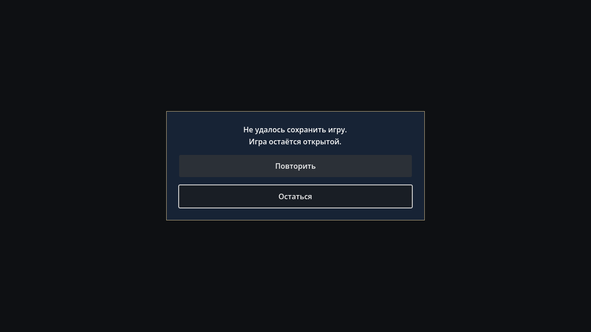

# Atomic save evidence — 2026-10-03 UTC

Accepted source `dd3068e8dabc07b71b17c128c21ddda86b33c186`; SHA-256 identities
in `manifest.json`. Fresh archive with no `.godot`, actual editor import and 199
tracked game/tools files unchanged after checks. Fourteen existing LFS identities
verified; eleven runtime copies reused. No new LFS upload/retrieval claim.

| Gate | Actual evidence |
| --- | --- |
| Import / regression | `clean_import.log`, `regressions.log`: parse/import, DTO, input matrix, actual player traversals/rays, pause/settings/fade and read-only debug PASS |
| Physical files | `regressions.log`, `graphical_dialog.log`: first backup, previous-valid primary backup, exact JSON numbers/Cyrillic, isolated reads, prepare-before-backup ordering PASS |
| Failure / recovery | Same logs: injected prepare/backup/primary replacement failures, actual missing-parent IO failure, directory obstacle, dirty retention/no-op clean flush, no temp leaks, corrupt-primary fallback/read-only preservation, both-bad decision and future-schema protection PASS |
| Bounded decoding | Same logs: oversize, malformed JSON/types and seven invalid UTF-8 sequences including overlong/surrogate/out-of-range/truncated encoding rejected; valid Cyrillic/emoji and upper Unicode boundary accepted PASS |
| Failed exit / modal | Same logs: actual App failure before production IO, GUI retry/stay/Esc, inherited pause/later lock/free cleanup, fade cancellation, Cyrillic and unchanged production files/settings/audio PASS |
| Actual native failed close | `graphical_dialog.log`: real X11 `WM_DELETE_WINDOW`, automatic quit disabled, failed dirty flush keeps window/modal alive PASS |
| Actual committed exits | `app_dirty_exit.log`, `native_dirty_exit.log`: real production App/SaveManager methods in fresh guarded XDG user directory, direct App and real native close exit zero; primary/backup equal exact JSON/hash, no temps/settings created PASS |
| Production startup | `graphical_engine.log`: authenticated TCP X11 + MIT-MAGIC-COOKIE, Vulkan Forward+, GameRoot/eight autoloads/safe exit PASS |

All accepted commands exit zero with no Godot errors. Development-only failures
were fixed before acceptance: headless GUI fixture used a 64×64 viewport instead
of the established 1280×720 setup; one inspector invocation omitted its explicit
`--expect-overlay` flag. Corrected clean checks pass. These were fixture mistakes,
not environment blockers. Graphics run serially on the confirmed TCP path.

Both corrupt files return an explicit decision for future Boot UI and remain
preserved; no automatic new-game overwrite or startup apply is implemented.
Authored checkpoints, registered world domain states, migrations beyond the first
real schema, Windows/hardware and power-loss durability remain separate work.
Godot flush/readback/same-directory rename is tested; fsync/directory durability
and multiple simultaneous game processes are not certified. No puzzle/story or
art budget changed; no physical GPU performance claim.
