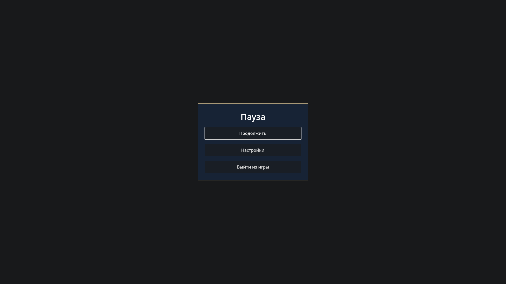

# Pause / fade evidence — 2026-10-03 UTC

Source `5d31141dce857cd551acf3084edcf198d8844322`; SHA-256 identities in
`manifest.json`. No initial `.godot`, actual fresh import, 183 tracked game/tools
files unchanged after checks. Fourteen existing LFS identities verified, eleven
runtime copies reused; no new binary upload/independent-download claim.

| Gate | Actual evidence |
| --- | --- |
| Pause / controller | `clean_import_tests.log`, `graphical_engine.log`: real Archive player walk then physical freeze, fresh/echo Esc, held W/recapture, mouse/Esc resume and LIMITED_LOOK restoration PASS |
| Nested settings | Same logs: real GUI opens settings while paused, Esc returns to pause, Apply updates actual camera FOV to 96 and stays paused PASS |
| Lock / lifetime | Same logs: unsupported modes/focus, later DISABLED with settings open, external resume and freed pause-root cleanup PASS |
| Fade / UI block | Same logs: animation while paused, awaited completion, overlap/invalid rejection, clear/free cancellation, visual cleanup before signal and immediate-cancel transparent cleanup; actual pointer/key block PASS |
| Integrity / exit | Production settings/save hashes and semantic game/audio values preserved; actual preference bus snapshot restored; Exit button dispatches production App safe exit PASS |
| Previous paths | `clean_import_tests.log`: settings (including defaults over typed text), InputMap/InputManager/read-only inspector PASS. `player_regression.log`: existing six traversals/walk/look/ray races PASS |
| Graphical / language | `graphical_engine.log`: authenticated TCP X11/Vulkan Forward+, actual 1920×1080 pause and 1280×720 loading images inspected; Russian glyphs PASS; production engine/eight autoloads startup PASS |

Settings Apply intentionally chooses its draft 1280×720 window before the loading
capture. The initial UI is readable; final UI art, Windows/physical input and
target-GPU certification remain open. The CLI fixture injects Godot events rather
than claiming native physical keyboard input.

The settings malformed-file negative case has one expected headless parser ERROR
and successful command exit. Graphical runs retain strict zero-ERROR acceptance.
No production settings/save files are written. The existing SaveManager still has
its scaffold behavior; safe-exit dispatch is tested, not full persistence.

Cinematic pause/hold-to-skip arbitration, main menu, world routing/checkpoints,
logical saves and semantic audio playback remain later work. No automatic fade
is attached to any authored scene transition, including Stage 14→15. Canonical
story/puzzle values, existing art binaries and global budgets are unchanged.

Integration: PR #35 merged as `eef002cf498ae7cad737f7ef0f05f5b9bc001d41`; tree `b6e32489ba0f0a35f66a18276efe42f62d5f2677` matches
the accepted feature. `epic_engine.log` confirms merged graphical startup.
GitHub reports MERGEABLE/CLEAN, with no configured CI checks; CI execution is
not claimed.
