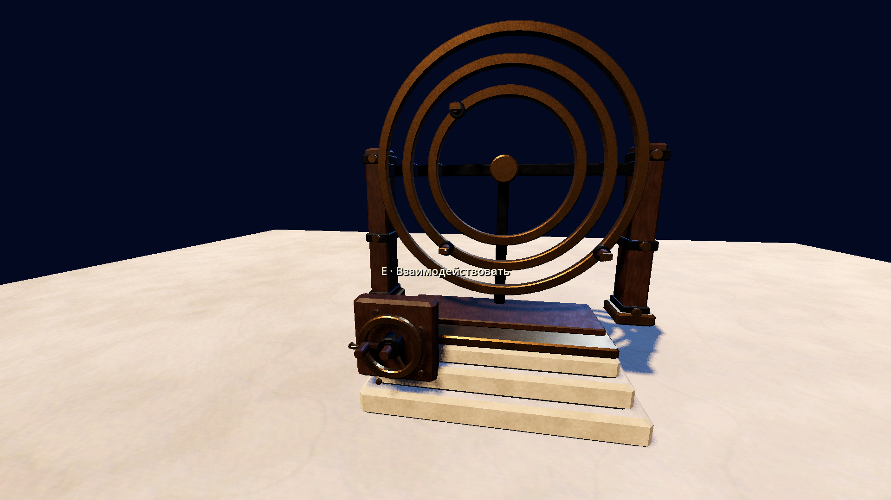

# Player / interaction evidence — 2026-10-03 UTC

Source `908f480b6caeb81adff5a7df33fc439cfd2d94e7`, code/image hashes in
`manifest.json`. Implementation brief and initial tuning: `PLAYER_INTERACTION.md`.

| Gate | Actual evidence |
| --- | --- |
| Fresh import / source isolation | `clean_import_tests.log`: no initial `.godot`, actual import succeeds; 168 tracked game/tools files unchanged after checks |
| Existing LFS identity | `payloads.json`: fourteen HEAD hashes/sizes verified using hydrated files/cache; eleven runtime copies in clean archive; no new upload or independent-download claim |
| Production controller / physics | Six actual Archive traversals at 0/90 degree yaws; all three lanes, feet Y ≈0.000338 m; walls stop capsule. `clean_import_tests.log` and `graphical.log` |
| Walk / look / settings / boundaries | Normalized diagonal, body heading, pause/focus/echo, unscaled pixels, pitch clamp, invert-Y, FOV and LIMITED_LOOK PASS |
| Interaction / race checks | E/echo, range, world occlusion, disabled/deleted/moved target, pause boundary, inside-solid query, disabled nearer target and queued collider PASS |
| Actual graphical / glyphs | `graphical.log`: authenticated TCP X11/Vulkan Forward+, actual grip component pick and E dispatch; Russian font glyph checks; inspected 1920×1080 `player_view.png` |
| Startup / previous paths | `engine.log`: actual graphical GameRoot/eight autoloads/safe exit PASS; clean InputMap/InputManager/debug state/file regressions in `clean_import_tests.log` |

Existing script-free art is adapted only inside the CLI test; no carrier or
solve angles/distances changed. The player is inactive in the empty production
root. Synthetic Godot keys/motions exercise the controller; native physical
keyboard/Windows and target GPU certification remain open. No story/puzzle or
final HUD art approval is implied. Scene routing/spawn and pause UI remain later
features.

Resolved harness findings: initial inside-camera box displaced the physical
capsule before the ray; isolated ray-only probe passes. First preview lacked
sky reflection; accepted Wing I lighting fixed visibility. Concurrent runners
selected the same X display; serial runner checks pass. Reuse the existing
TCP/cookie path and run these graphical checks serially.
