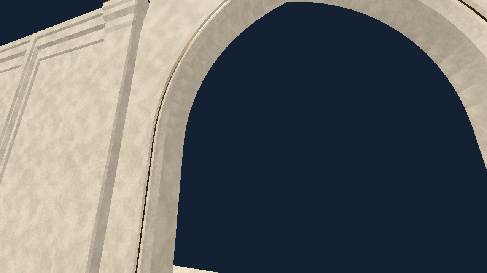

# SceneRouter evidence — 2026-10-03 UTC

This is an unfinished feature checkpoint, not full acceptance or main integration.
`manifest.json` distinguishes clean contract source from the later prototype.

Contract logs: fresh import, actual registered threaded resource preload, isolated
StageDefinition copies, full stage/checkpoint/domain validation and offline nested
upright spawn PASS. The clean archive's 206 tracked files remain unchanged;
fourteen existing LFS identities verified, eleven runtime payloads reused.
Input/pause and authenticated TCP X11/Forward+ production startup PASS.

Latest prototype logs: editor import, actual Forward+ transition smoke and
production startup PASS. Initial replace/state/player/fade, overlaps, wrong
checkpoint, injected domain apply failure, later identical DISABLED ownership,
removed root and actual blocked capsule spawn checks pass. No production save or
settings write is performed. Full fresh-prototype regression/acceptance is open.

`physics_development.log` retains superseded failures and the successful fix.
PROCESS_MODE_DISABLED initially removed CollisionObject3D from physics space;
candidate collider disable modes now retain query presence while callbacks are
frozen, then restore their authored modes. A separate earlier freed-reference
typed-assignment bug was corrected with lifetime guards before prototype PASS.
These were implementation errors, not environment/capability blockers.

Resume requirements and remaining cases are listed in `SCENE_ROUTER.md`.
No shipping story worlds, solve parameters, target GPU or Windows acceptance.

## Accepted core in the renewed window

`accepted_source` and `graphical_source` in `manifest.json` identify the completed
core. Fresh final archive initially has no `.godot`; all 242 tracked files remain
unchanged (`accepted_archive.json`, `archive_integrity.log`). Fourteen payload
identities verified; eleven existing runtime payloads copied. No new transfer gate.

| Actual gate | Evidence |
| --- | --- |
| Fresh import / complete headless baseline | `accepted_import.log`, `headless-*.log`: 18 fixtures PASS, including prior input/player/settings/pause/debug/DTO/atomic save and modular/Wing I physics |
| Checkpoint / physical transaction | `headless-router_transaction.log`, `graphics-router_transaction.log`: real isolated checkpoint failure/success, backup/dirty/preload ordering, post-commit rollback, restored ground/callback/rigid modes, disabled colliders and nested spawn PASS |
| Preload / lifetime ownership | `headless-router_preload.log`, `graphics-router_lifetime.log`: real delayed workers, cancellation/timeout and token collection; removal/rebind at all four phases; later fade/input ownership; freed player/HUD/Pause PASS |
| Seamless S14→15 | `graphics-router_seamless.log`, `seamless_before.png`, `seamless_after.png`: same world/camera/feet/look, no loading frame/fade, exact equal visible framebuffers PASS |
| Full graphical baseline | `graphics-*.log`: 11 serial X11/Vulkan Forward+ fixtures, actual native focus, Russian menus, real physics and production startup PASS |
| Actual safe exits | `exit-normal.log`, `exit-failure.log`, `exit-native.log`: App first rolls back temporary target, real primary/backup contain original stage; failed native close remains alive and GUI Stay restores gameplay PASS |
| Prior exit regression | `baseline-exit-normal.log`, `baseline-exit-native.log`: accepted atomic/direct/native exit remains PASS |
| Ref/payload safety | `archive_integrity.log`, recovery logs: immutable object hydration, authenticated existing LFS retrieval, exact identities and Git/LFS fsck PASS |

The one preexisting malformed ConfigFile diagnostic is expected only in headless
settings coverage; every other accepted check and all graphical checks are clean.
`resolved_render_fps_fixture_failure.log` is superseded: observing a two-physics-tick
phase on process frames missed it at 30 FPS; the corrected fixture observes actual
physics frames. The old smoke now waits for tracked loader drain before unregister.
The first scratch archive omitted the two immutable JSON art contracts; including
them restored the old art checks. No environment blocker or production asset change.

Shipping story controllers/registry, Boot, authored final choreography, audio mix/
silence, target hardware and Windows remain separate. The partial-checkpoint prose
above records earlier history, not the current core acceptance status.
