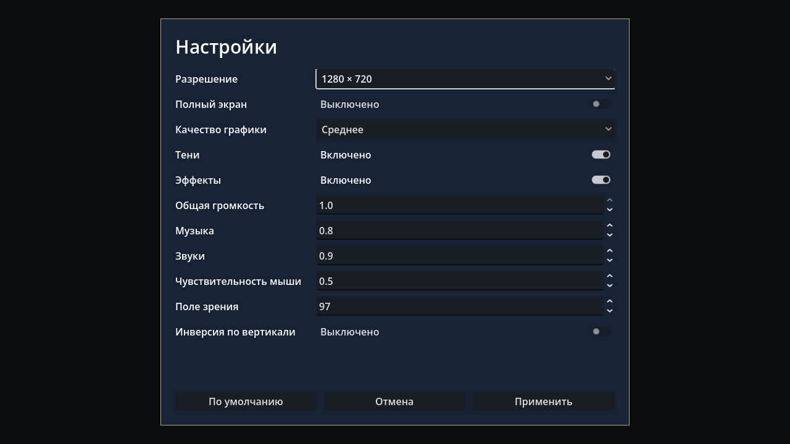

# Settings evidence — 2026-10-03 UTC

Source and SHA-256 file/image identities: `manifest.json`. Clean source
`ea78c151d62cdf4d0c3fe573e6016d794bf55327`; no initial `.godot`, 174 tracked
game/tools files unchanged after checks. Fourteen existing LFS payload identities
were verified; eleven runtime payloads copied from the hydrated worktree/cache.
This code-only feature does not claim a new independent LFS download.

| Gate | Actual result |
| --- | --- |
| Fresh import / persistence | `clean_import_tests.log`: typed replacement/round-trip from reset state; clamps; invalid types/nonfinite/resolution/preset, versions, missing fields, oversize/malformed files; failed write/rename preserve live values/file; temporary cleanup PASS |
| Existing baselines | `clean_import_tests.log`: InputMap, InputManager and opt-in read-only debug state/file regressions PASS |
| Player / actual mixer | `player_mixer.log`: six actual Archive passages, controller/ray regressions; all ten real mixer routes, half-gain/mute/branch independence and restored startup preferences PASS |
| Graphical controls | `graphical_1280.log`, `graphical_1920_engine.log`: real GUI mouse Cancel/Apply, numeric text without Enter, Esc, draft defaults, failed Apply message, paused modal and later lock PASS |
| Graphics / display | Same graphical logs: authenticated TCP X11/Vulkan Forward+, native fullscreen/windowed dimensions, render-height target, author resource/effect/shadow restoration and later world attachment PASS |
| Russian form / startup | Actual 1280×720 and 1920×1080 screenshots inspected; all fields/actions visible, glyphs/bounds pass. `graphical_1920_engine.log`: production GameRoot/eight autoloads/safe exit PASS |

One parser ERROR is expected only for the malformed isolated headless ConfigFile
negative case. All subsequent tests and the full command exit successfully.
Graphical acceptance retains strict rejection of any ERROR; it excludes this one
negative parser case. No production settings/save files are written by fixtures.

`resolved_numeric_commit_failure.log` is superseded: stronger typed-text test
caught an actual stale SpinBox value; explicit apply-before-read fixes it.
`resolved_display_probe.log` is superseded: Godot consumed engine display args;
the launcher now forwards the explicit `--preserve-display` user flag. Initial
headless Window sizing and form spacing/labels were fixed before final acceptance.

This is a reusable hidden modal and initial quality mapping. Main-menu/pause entry
points, complete world content, authored finale transitions, physical Windows
behavior and target-GPU profiling remain separate work. No art/puzzle/canon or
performance budget was changed. Atomic rename was tested on this Linux filesystem;
it does not certify power-loss behavior or Windows filesystem replacement.
