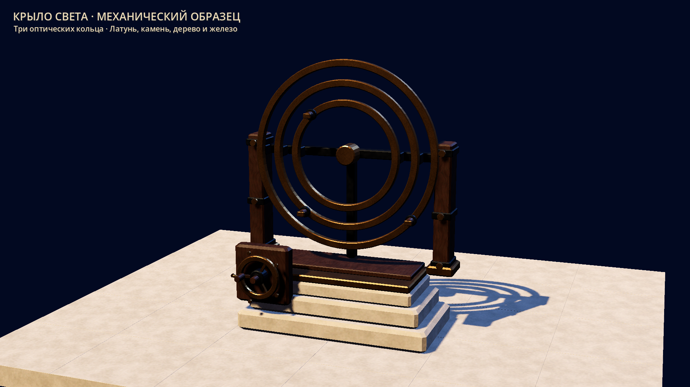
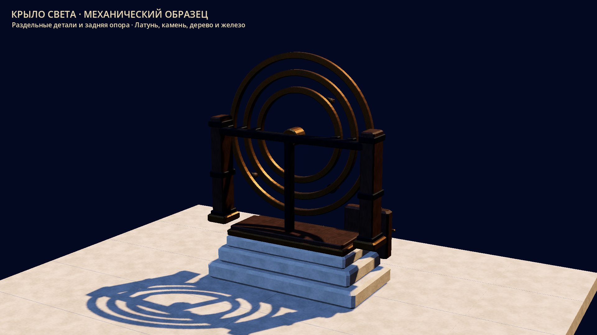
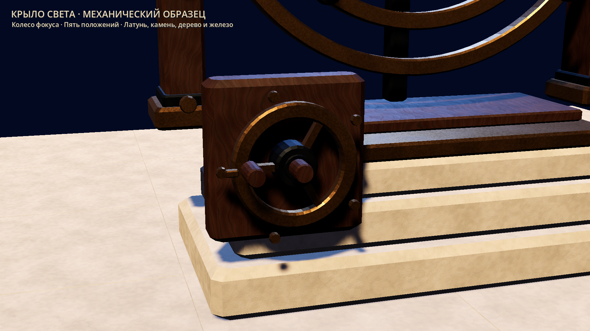

# Wing I optical carrier evidence — 2026-10-03 UTC

Producer source/import/physics/three-view gates and independent upload /
retrieval / fresh verification: **PASS for the bounded carrier**.
Scope is the bounded S02-001/S02-003 art carrier in
[`WING01_OPTICS_SAMPLE.md`](../../WING01_OPTICS_SAMPLE.md), not the playable puzzle.

Existing production docs and successful preflights were read first. Standing
Extra High / highest available request applies; no agent-side model change is
claimed. Confirmed local Blender 4.5.14 LTS and Godot 4.7.2, authenticated Xvfb
TCP/MIT-MAGIC-COOKIE → X11/Vulkan Forward+ were reused. No dependencies needed
reinstallation. Authentication, LFS batch/download, permissions, push dry-run
and disk checks: [auth](auth_preflight.log), [refs/disk](ref_disk_preflight.log),
[minimum capabilities](capability.log). No migration or ref rewrite performed.

## Actual producer gates

| Gate | Evidence / actual result |
|---|---|
| Original source/export | [final authoring](authoring_final.log); one .blend and five GLBs |
| Reopened saved source | [source](source_final.log); correct absolute filepath, five deliberate joints, unit transforms, 57 outward closed solids, metric UVs, normals/tangents, actual ring aperture/band rays and five raised stop centers/intervals |
| Runtime import/physics | [final import/physics](source_import_physics_final.log); 8,636 triangles, 16 surfaces referencing four exact existing shared materials; 40 independent poses, 48 actual Area rays, two assembly yaws and simple blocking collision |
| Actual graphical review | [front](front.log), [reverse](reverse.log), [focus](focus.log); actual 1920×1080 PNGs manually inspected; three rings/grips, stepped base, rear support and all five focus markers readable |
| Moving parts render | Front review isolates each part against a blank frame; ring/focus pose changes exceed the pixel threshold; all five parts contribute to the framebuffer |
| Existing contracts | [preservation](contract_preservation.log); fourteen fingerprints, Archive technical JSON, shared material/map resources, architecture, GameRoot/services unchanged |
| Export meter bounds | [bounds](export_bounds.log); reopened source and GLB accessor envelopes agree on all three axes within 2 micrometers for all five parts |
| LFS pointers / real upload | [pointer checkpoint](pointer_commit.log), [upload/producer fsck](upload_producer_fsck.log); six exact committed SHA-256/size pointers, six real uploads, producing Git/LFS fsck PASS |
| Independent clone / ordinary Git | [clone](fresh_clone.log), [isolation](fresh_isolation.log), [hydration](fresh_hydration.log); remote shallow HEAD `a3c11209d7218fe2ba08b402bac054d6d49f7cc8`, no alternates/shared store; all 555 immutable HEAD blobs / 1,519,958,847 bytes restored with Git hash/size checks, refs unchanged |
| Independent LFS download | [retrieval](fresh_retrieval.log); six pointer-only new files and zero private payloads before actual pull; six hashes/sizes match, fourteen total HEAD payloads in private store |
| Retrieved copy opens/runs | [fresh verification](fresh_verify.log); absolute fresh .blend/script/project paths and synchronized PWD; actual opened filepath asserted; source/topology/UV/stop/bounds, import/physics, authenticated graphical GameRoot startup and full Git/LFS fsck PASS; clean fresh working tree |

`payload_manifest.json` pins all six binaries: **2,215,808 bytes** total.
`validation_manifest.json` pins the nine current reference hashes, preserved
contracts, recipes/wrapper/tests and inspected screenshots. Original project
geometry; no concept pixels or external meshes embedded. No new maps, shaders,
material copies, animations or production UI. Local triangle ceilings remain
below the approved 12,600 total; global budgets remain unchanged.

Preview counters (software llvmpipe, isolated carrier + 30 existing floor tiles):
front 56, reverse 42, focus 38 draw calls; 127,216,128 total texture bytes including
viewport/sky. These do not certify physical GTX1060-class performance.

## Resolved review defects and superseded runs

`source_import_initial.log`, `import_physics_initial.log`, `authoring.log` predate
six rear track shoes. Final source/import/physics logs and manifest supersede
their 8,276-triangle count. The shoes contact each ring's rear track without
introducing a fourth optical ring. Source inspection verifies each independent
solid's outward winding and actual five-stop hardware with stored triangle rays.

The first graphical command omitted the previously confirmed explicit
`--resolution 1920x1080`: [resolution diagnostic](front_resolution_diagnostic.log).
The checker rejected the default 1280×720 window. Reusing the exact earlier
command setting resolves it without project changes. Initial full/focus framing
cropped the crown/base or focus markers: [front](front_framing_diagnostic.log),
[focus](focus_framing_diagnostic.log). Cameras were moved/retargeted and the final
PNGs recaptured and inspected. No environment blocker was inferred. Logs preserve
commands/stdout/stderr; ANSI colors and trailing whitespace are normalized.

`fresh_store_diagnostic.log` records a checker that counted Git LFS's empty
directory scaffolding as payloads. Inspection found 28 directories and **zero
files**, with the correct private LocalMediaDir and empty LocalReferenceDirs.
The corrected file-only check passes before download in `fresh_retrieval.log`.
No previous payload, alternate store, auth or permission failure occurred.
Ordinary-Git hydration reused the confirmed eight-worker path with a finite
780 s command bound; it completed on the first run without ref changes. Producer
fsck's dangling blobs are informational, not missing/corrupt reachable objects.

## Reproduction

Use absolute source/script/project paths and set cwd/PWD to the inspected clone.
Run `verify_wing01_optics_source.py` through Blender with `--python-exit-code 1`;
run Godot editor `--headless --import`, then `wing01_optics_smoke.gd` with finite
`--max-fps 60 --quit-after 1200`. Require actual PASS markers and no errors.
For real graphics, use `tools/run_graphical.py` with the confirmed graphics
prefix, Vulkan/X11 Forward+, explicit `--resolution 1920x1080`, and
`wing01_optics_review.gd -- --view=front|reverse|focus --screenshot=<absolute.png>`.
Only the review script adds Russian CLI labels and lights. Neither wrapper nor
art implements selection/input behavior or puzzle success/reward/save rules.

Safe regeneration uses an empty disposable output root; the source recipe
refuses to overwrite authored binaries. `assemble_wing01_optics.py` builds the
wrapper; after the first Godot import, `--configure-imports` remaps shared
materials and disables sample-local automatic LOD/compression/animation import.
Then reimport and verify exact resource identity. Forward-only LFS applies.
